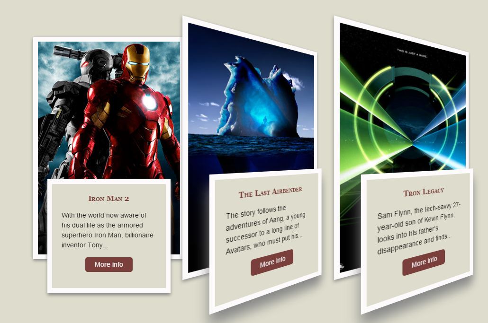

demo目录
==============
1. [retina-1px.html](http://qnlz.github.io/demo/retina-1px.html)
---------------------
retina下1px解决方案

2. [css-drop-shadow-without-images.html](http://qnlz.github.io/demo/css-drop-shadow-without-images.html)
---------------------
css实现阴影的多种情况

3. [3d-animation-css3](http://qnlz.github.io/demo/3d_animation_css3/)
---------------------
纯CSS实现的动画效果

4. [左右两侧内容自适应](http://qnlz.github.io/demo/left-and-right-flex.html)
---------------------
左右两侧内容自适应，参考bootstrap(http://getbootstrap.com/components/#input-groups)

利用table-cell的原理

5. [楼层电梯导航](http://qnlz.github.io/demo/lift.html)
---------------------
主要知识点：offset().top   scrollTop()

6. [模拟手势下拉图片整屏](http://qnlz.github.io/demo/swipe/swipe.html)
---------------------
主要知识点：touchSwipe插件